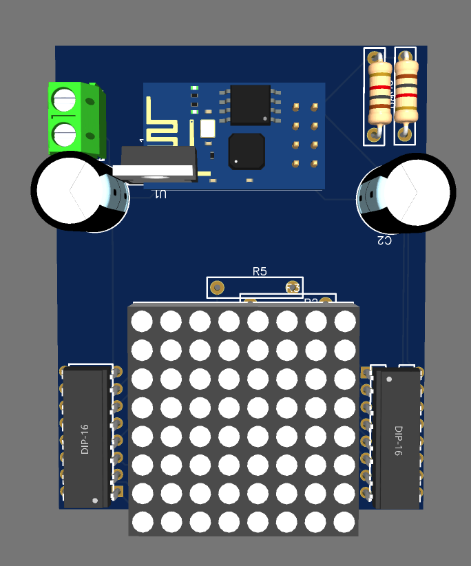
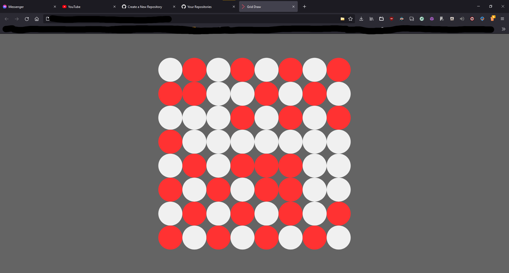

# ESP Display
Interactive display based on 8x8 LED grid panel. 

User connects to domain hosted on the Esp8266 (ESP-01) and gets presented a grid which can be drew on. Every change is sent in real time and saved upon leaving the website.

2 shift registers allow for access of all 64 leds using just 3 wires, which allows for esp-01 to be used for this project.

## Project is build on 2 connected prototype boards

## Website

## License and copyright

© Dawid Pietrykowski

Licensed under the [MIT LICENSE](LICENSE)